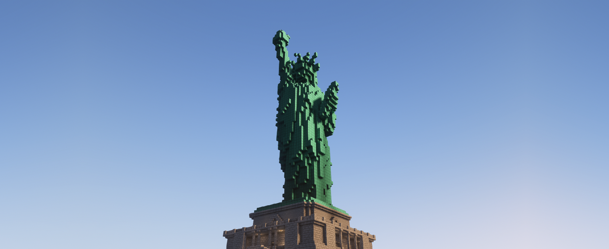

# Начало


В настоящее время документация находится в разработке!

В некоторых разделах документации возможно присутствие неактуальной информации или незавершённости


<figure><figcaption>
Статуя свободы, построена игроками в одном из городов
</figcaption></figure>

## Что такое #WhoMine

Это приватный _**RP-Survival**_ сервер для друзей, где ты можешь стать кем угодно и воплотить свои фантазии в захватывающем игровом мире. Ограничений по твоим возможностям **нет**, лишь важно соблюдать **правила сервера**. Создай своего уникального персонажа и наслаждайся незабываемыми приключениями на сервере вместе с другими!

<table data-view="cards"><thead><tr><th align="center"></th><th data-hidden data-card-cover data-type="files"></th><th data-hidden data-card-target data-type="content-ref"></th><th data-hidden align="center"></th><th data-hidden align="center"></th><th data-hidden align="center"></th></tr></thead><tbody><tr><td align="center">На сервере вы обнаружите уникальный выбор <em>кастомных блоков</em>, которые добавляют разнообразие для творчества и декорирования ваших построек</td><td><a href=".gitbook/assets/blocks.png">blocks.png</a></td><td><a href="mechanics-and-commands/custom-assortment/blocks.md">blocks.md</a></td><td align="center"><strong><code>Блоки</code></strong></td><td align="center">Блоки</td><td align="center">•</td></tr><tr><td align="center">На сервере присутствуют <em>уникальные декорации</em>, включая кастомные варианты, позволяющие придать особую атмосферу вашим постройка</td><td><a href=".gitbook/assets/decorations.png">decorations.png</a></td><td><a href="mechanics-and-commands/custom-assortment/decorations.md">decorations.md</a></td><td align="center">Декорации</td><td align="center"></td><td align="center"><strong>Декорации</strong></td></tr><tr><td align="center">На сервере представлены разнообразные <em>кастомные предметы</em>, которые позволят вам насладиться новым, а также уникальным опытом игры</td><td><a href=".gitbook/assets/items.png">items.png</a></td><td><a href="mechanics-and-commands/custom-assortment/items.md">items.md</a></td><td align="center">Предметы</td><td align="center"></td><td align="center"><strong>Предметы</strong></td></tr></tbody></table>
